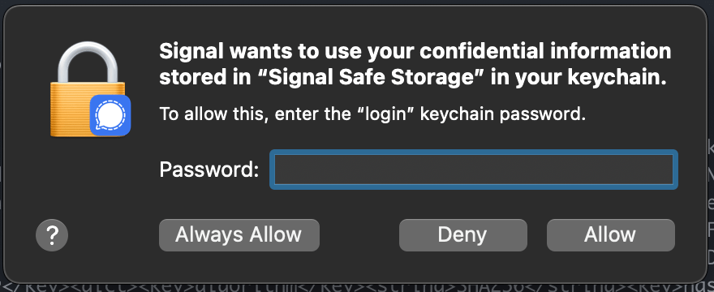
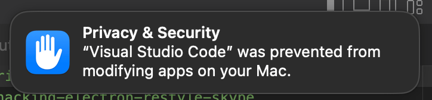

# Electron App Patcher

Patch an Electron app to apply your own changes (macOS only for now)

## Setup

Electron App Patcher requires a certificate to sign the app again after it has been patched (see https://stackoverflow.com/a/27474942/1268612).

1. Clone the repo and run `pnpm` to install the dependencies
2. Open Keychain Access
3. Open the menu item Keychain Access > Certificate Assistant > Create a Certificate...
4. For the name, enter `electron-app-patcher-self-signed-cert`
5. Under "Certificate Type", select "Code Signing"
6. Check the box "Let me override defaults" and click "Continue"
7. In "Validity Period (days)", enter `7300`, the highest possible value
8. Create the certificate

## Usage

Run `pnpm run patch <patch name>` in the `electron-app-patcher` directory, and it will patch your app based on the transforms in the patch file in the `patches/` directory. For example, with the included `patches/signal.ts` patch:

```bash
$ pnpm run patch signal
Creating a backup of app.asar...
Processing preload.bundle.js...
Repacking app.asar to enable patch...
Updating hash in Info.plist to bypass asar integrity check...
Signing app with self-signed certificate...
Done!
✨  Done in 6.66s.
```

You will receive a prompt during the app signing to enter your password, since the `codesign` command needs access to the self-signed certificate created in **Setup** above.

After opening the patched app, you may receive a permissions prompt for access to confidential information in your keychain because of the re-signing of the app. Only allow access to information that you believe the app should have access to.

<figure>
  
  <figcaption>
    <em>
      Screenshot of security notification in macOS showing the message <code>Signal wants to use your confidential information stored in "Signal Safe Storage" in your keychain.</code>.
    </em>
  </figcaption>
  <br />
  <br />
</figure>

### Restore `app.asar` backup

```bash
$ pnpm run patch signal restore-backup
```

### Delete `app.asar` backup

```bash
$ pnpm run patch signal delete-backup
```

## How?

Electron App Patcher works by modifying the files inside the [asar archive](https://github.com/electron/asar):

1. `<app>/Contents/Resources/app.asar` is backed up to `<app>/Contents/Resources/app.asar.bak`
2. `<app>/Contents/Resources/app.asar` is extracted to `<app>/Contents/Resources/app/`
3. All transforms in your specified patch file are applied to files in `<app>/Contents/Resources/app/`
4. The contents of `<app>/Contents/Resources/app/` are packed into `<app>/Contents/Resources/app.asar`
5. The SHA256 hash of the header of the `<app>/Contents/Resources/app.asar` file is calculated and updated in the `<app>/Contents/Info.plist` file (to avoid errors from asar integrity check)
6. App is signed with self-signed certificate

## Troubleshooting

### macOS Security Warning

Newer versions of macOS may prevent the app where you run the script from modifying apps on your computer and require you to allow access manually:

<figure>
  
  <figcaption>
    <em>
      Screenshot of security notification in macOS showing the message <code>"Visual Studio Code" was prevented from modifying apps on your Mac</code>.
    </em>
  </figcaption>
  <br />
  <br />
</figure>

## Credit

Credit for the original script goes to [@degecko](https://github.com/degecko):

- https://www.codepicky.com/hacking-electron-restyle-skype
- https://github.com/codepicky/skype-patch
